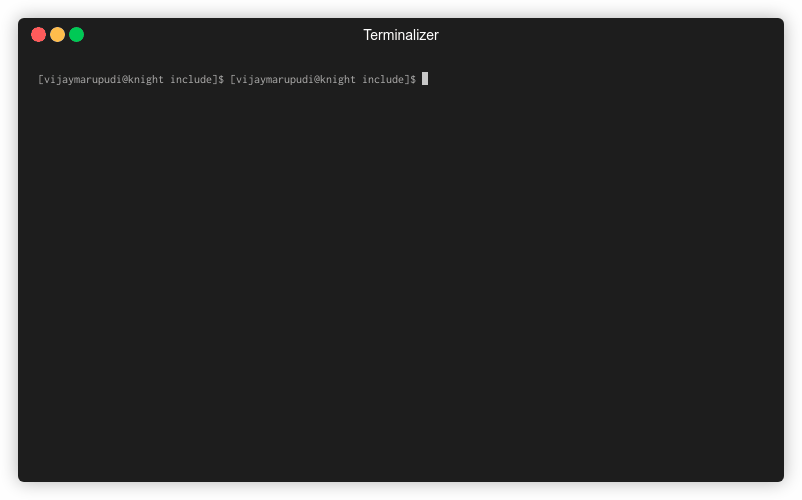
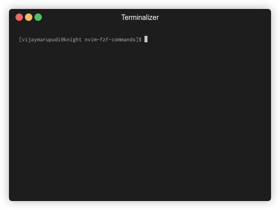
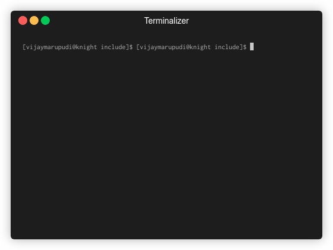
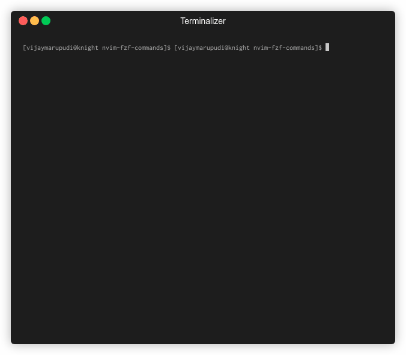
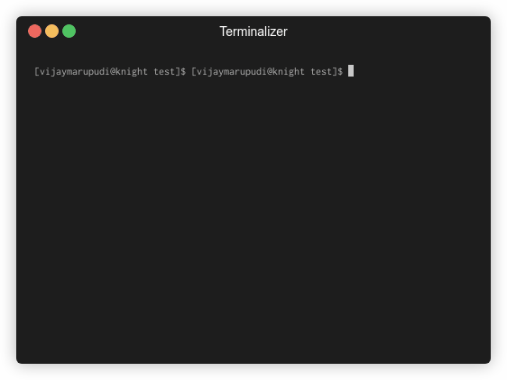

# nvim-fzf-commands

A repository for commands using the
[`nvim-fzf`](https://github.com/vijaymarupudi/nvim-fzf) library.

This is a work in progress, contributions welcome!

## Table of contents

* [Usage](#usage)
* [Commands](#commands)
* [Configuration](#configuration)
* [Contribution notes](#contribution-notes)

## Usage

This repository exports lua functions for the user to bind to vim
commands or keybindings.

**Example**

```vim
noremap <leader>f <cmd>lua require("fzf-commands").files()<cr>
" or
command! Files lua require("fzf-commands").files()
" or with configuration
noremap <leader>f <cmd>lua require("fzf-commands").files({ fzf = custom_fzf_function })<cr>
```

## Commands

These are keys of `require("fzf-commands")`. For eg.:
`require('fzf-commands').files()`

`files(options)`: Open files in the current vim directory

* List files (using [`fd`](https://github.com/sharkdp/fd) if available,
  otherwise `find`)
* Preview (using [`bat`](https://github.com/sharkdp/bat) if available,
  otherwise `head`)
* Supports opening multiple files
* Can open files in the same window, in a [vertical] split, or in a new
  tab (`enter`, `ctrl-s`, `ctrl-v`, `ctrl-t`).


`helptags(options)`: Open neovim help files

* Can open files in the same window, in a [vertical] split, or in a new
  tab (`enter`, `ctrl-s`, `ctrl-v`, `ctrl-t`).



`bufferpicker2(options)`: Pick between buffers to switch to them or open
  in a split.

* Preview the buffers (with neovim syntax highlighting!)
* Can handle multiple buffers
* Can open files in the same window, in a [vertical] split, or in a new
  tab (`enter`, `ctrl-s`, `ctrl-v`, `ctrl-t`).
* Options:
  * `options.height` (number): the height of the split
  * `options.unloaded` (boolean): show unloaded buffers
  * `options.unlisted` (boolean): show unlisted buffers
  * `options.direction` (string: `"top"` / `"bottom"`): where to display
    the split.
  * does **not** take `options.fzf`, because this function opens two
    windows, one for fzf, one for the preview.



`bufferpicker(options)`: Pick between buffers to switch to them or open in a
  split.

* Preview the buffers (plaintext)
* Can handle multiple buffers
* Can open files in the same window, in a [vertical] split, or in a new
  tab (`enter`, `ctrl-s`, `ctrl-v`, `ctrl-t`).




`manpicker(options)`: Open a manpage using nvim's `Man`.

* Can open files in the same window, in a [vertical] split, or in a new
  tab (`enter`, `ctrl-s`, `ctrl-v`, `ctrl-t`).



`rg(pattern, options)`: Search for a pattern using `rg` (ripgrep).

* Can handle opening multiple search results
* Can open files in the same window, in a [vertical] split, or in a new
  tab (`enter`, `ctrl-s`, `ctrl-v`, `ctrl-t`).

  Example usage:

  ```vim
  command! -nargs=1 Rg call luaeval('require("fzf-commands").rg(_A)', <f-args>)
  nnoremap <leader>r :<c-u>Rg<space>
  ```


`colorschemes(options)`: Pick a vim colorscheme.

* Previews the colorscheme live as you navigate them.



## Configuration

All commands support a custom fzf function that manages opening windows
and running fzf.

**Example changing height and width of default window**

This example uses `window_options`, documentation
[here](https://github.com/vijaymarupudi/nvim-fzf#api-functions)

```lua
require("fzf-commands").files({ fzf = function(contents, options) 
  return require("fzf").fzf(contents, options, { height = 10, width = 30 })
end })
```

**Other examples**

```lua
function my_custom_fzf(contents, options)
  vim.cmd("vnew")
  local results = require("fzf").raw_fzf(contents, options)
  vim.cmd("bw!")
  return results
end
require("fzf-commands").files({ fzf = my_custom_fzf })
```

or


```vim
" vertical fzf
lua << EOF
  function my_custom_fzf(contents, options)
    vim.cmd("vnew")
    local results = require("fzf").raw_fzf(contents, options)
    vim.cmd("bw!")
    return results
  end
EOF
command! Files lua require("fzf-commands").files({ fzf = my_custom_fzf })
```

For other configuration, please see command specific documentation.

## Contribution notes

**Contributions welcome!**

* Any improvements (previews, bindings) to existing commands welcome!
* Any commands relevant to vim or common unix tools welcome!
* Issues welcome for edge cases or need for configurability.
  Configuration should only be added if the user needs it.
* Commands must be asynchronous at all costs for UI speed reasons.
* A gif demonstrating the command would be appreciated.
* All commands should take an fzf configuration option that provides the
  fzf command to use instead of the default `nvim_fzf.fzf` function.
